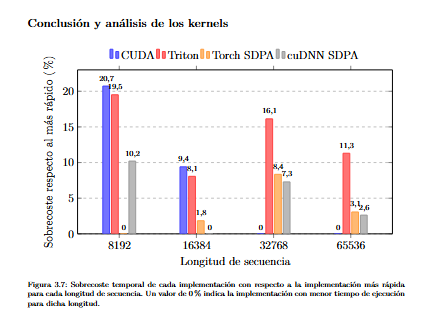

# TFG — FlashAttention en GPU

Implementación, optimización y perfilado de **FlashAttention no causal** en **CUDA** y **Triton** para GPUs NVIDIA Ampere, con comparación frente a **Torch SDPA** y **cuDNN SDPA**.

El proyecto estudia cómo distintas decisiones de bajo nivel —uso de registros y memoria compartida, Tensor Cores, ocupación, número de *warps*, múltiples buffers, *loop unrolling*, políticas de caché y aproximación de la exponencial— afectan al rendimiento final del kernel.

## Resultados

Las implementaciones se evaluaron para longitudes de secuencia de **8192, 16384, 32768 y 65536**, con dimensión de cabeza `d = 128` y datos BF16.



El repositorio incluye también los informes completos de NVIDIA Nsight Compute (`.ncu-rep`) y los resultados obtenidos durante la búsqueda de hiperparámetros con Optuna.

## Requisitos

El proyecto está preparado para una GPU NVIDIA Ampere con *compute capability* **8.6**. La configuración utilizada durante el TFG emplea:

- CUDA 13
- Python 3.12+
- PyTorch 2.13+
- CMake y Ninja
- NVIDIA Nsight Compute para el perfilado
- `uv` para gestionar el entorno Python

Antes de compilar, puede ser necesario adaptar las rutas de CUDA y Python de `CMakeUserPresets.json` al sistema donde se ejecute el proyecto.

## Instalación

Con `uv` instalado:

```bash
uv sync
```

## Compilación

El repositorio contiene distintos presets de CMake con las configuraciones utilizadas para cada longitud de secuencia. Por ejemplo, para `N = 8192`:

```bash
uv run cmake --preset angel-wsl-8192
uv run cmake --build --preset angel-wsl-8192
```

Los presets para los experimentos son:

```text
angel-wsl-8192
angel-wsl-16384
angel-wsl-32768
angel-wsl-65536
```

## Validación

Para recompilar cada configuración y comparar numéricamente la implementación CUDA con Torch SDPA:

```bash
./validez.sh
```

El script ejecuta las pruebas para las cuatro longitudes de secuencia utilizadas en los experimentos.

## Perfilado

Para perfilar CUDA, Triton, Torch SDPA y cuDNN SDPA con NVIDIA Nsight Compute:

```bash
./profile.sh
```

El script solicita la longitud de secuencia, recompila la implementación CUDA con el preset correspondiente y genera los informes `.ncu-rep` dentro de `profile/`.

## Optuna

La búsqueda automática de configuraciones CUDA puede ejecutarse con:

```bash
uv run python src/py/tfg_fa/cuda_optimizer.py
```

El optimizador explora parámetros como el número de bloques por SM, *warps*, buffers, *loop unrolling* y política de caché. Los resultados se guardan como CSV dentro de `profile/`.

## Contenido del repositorio

```text
include/                       Kernel CUDA y utilidades de bajo nivel
src/cuda/                      Binding de PyTorch y launcher CUDA
src/py/tfg_fa/triton_impl.py   Implementación en Triton
src/py/tfg_fa/cuda_optimizer.py
test/                          Validación, benchmarks y perfilado
profile/                       Resultados de Optuna e informes de NCU
docs/doc.pdf                   Memoria del TFG
CMakeUserPresets.json          Configuraciones utilizadas
profile.sh                     Perfilado de las implementaciones
validez.sh                     Validación numérica
environment_report.sh          Información del entorno de ejecución
```

La memoria completa del trabajo se encuentra en [`docs/doc.pdf`](docs/doc.pdf).
