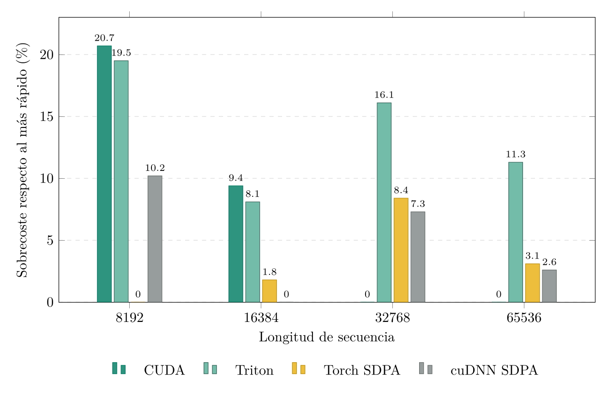

# TFG — FlashAttention en CUDA para NVIDIA Ampere

Implementación, optimización y análisis de una variante **forward, no causal** de FlashAttention para GPUs NVIDIA Ampere, desarrollada como Trabajo Fin de Grado.

El repositorio contiene:

- una implementación propia en **CUDA C++** orientada a `sm_86`;
- una implementación de referencia en **Triton**;
- comparativas con **PyTorch SDPA** y **cuDNN SDPA**;
- validación numérica frente a PyTorch;
- búsqueda de configuraciones con **Optuna**;
- perfiles completos de **NVIDIA Nsight Compute** (`.ncu-rep`);
- el script de **Sollya** y el test CUDA utilizados para construir y validar la aproximación polinómica de la exponencial.

> **Alcance experimental.** Los resultados del TFG corresponden a una NVIDIA GeForce RTX 3090 (compute capability 8.6), BF16, dimensión de cabeza `d = 128`, atención densa no causal y longitudes de secuencia `8192`, `16384`, `32768` y `65536`. Las configuraciones incluidas en los presets están ajustadas específicamente para esos cuatro casos.

## Resultados principales

Duración medida con NVIDIA Nsight Compute mediante `gpu__time_duration.sum` en el entorno de referencia del TFG:

| Longitud | CUDA propio | Triton | Torch SDPA | cuDNN SDPA |
| ---: | ---: | ---: | ---: | ---: |
| 8 192 | 0.912 ms | 0.903 ms | **0.755 ms** | 0.832 ms |
| 16 384 | 3.609 ms | 3.565 ms | 3.360 ms | **3.299 ms** |
| 32 768 | **12.247 ms** | 14.222 ms | 13.270 ms | 13.140 ms |
| 65 536 | **44.760 ms** | 49.824 ms | 46.136 ms | 45.940 ms |

Para `N = 8192`, el tiempo de Torch SDPA es la suma de sus kernels `split-KV` y `combine`.



Los perfiles utilizados para el análisis se conservan en [`profile/`](profile/), junto con los CSV de las búsquedas realizadas con Optuna y un informe completo del entorno experimental.

## Características de la implementación CUDA

La implementación estudia, entre otras, las siguientes técnicas:

- Tensor Cores mediante `mma.sync.aligned.m16n8k16` con entradas BF16 y acumulación FP32;
- transferencias GMEM → SMEM con `cp.async`;
- carga SMEM → registros con `ldmatrix`;
- layouts con *swizzling* para reducir conflictos de bancos;
- *multibuffering* para solapar movimiento de datos y cómputo;
- *double buffering* de fragmentos SMEM → registros;
- control de *warps* por CTA y `__launch_bounds__`;
- *loop unrolling* configurable;
- *cache hints* de L2 (`evict_first` / `evict_last`);
- *shared-memory register spilling* de CUDA 13.0;
- aproximación polinómica de la exponencial ejecutada mediante FMA.

## Aproximación de la exponencial

El kernel CUDA no utiliza `__expf()` para el *softmax*. La función utilizada realmente es `exp_poly2_scaled` de [`include/exps.cuh`](include/exps.cuh).

Para `d = 128`, el factor

```text
scale = 1 / sqrt(128)
```

se fusiona con la conversión a base 2:

```text
exp(scale * x) = 2^(x * scale * log2(e)).
```

Tras la reducción de rango `y = n + f`, con `f` aproximadamente en `[-0.5, 0.5]`, se evalúa

```text
2^f ≈ 1 + f * (0.702941834926605224609375
               + f * 0.23986406624317169189453125).
```

Los coeficientes se generan con [`src/sollya/exp_poly2.sollya`](src/sollya/exp_poly2.sollya) utilizando `fpminimax`, coeficientes `single`, error relativo y término constante fijado a `1`.

`fpminimax` calcula internamente una aproximación minimax utilizando el mismo algoritmo empleado por `remez`. El script establece además una **precisión de trabajo de 200 bits** mediante:

```text
prec = 200!;
```

Esta precisión corresponde a los cálculos internos realizados por Sollya y no al formato final de los coeficientes, que se restringe a precisión `single`.

El máximo error relativo del polinomio sobre `[-0.5, 0.5]` es aproximadamente `0.19634037 %`.

El test [`test/test_exp.cu`](test/test_exp.cu) compara la aproximación con `__expf()` sobre 10 millones de muestras, con semilla `0`, y convierte ambos resultados a BF16. En los resultados documentados en la memoria:

- `80.165900 %` coincide exactamente (`0 ULP` BF16);
- `19.834100 %` difiere en `1 ULP` BF16;
- no se observaron diferencias de `2 ULP` o superiores.

## Requisitos

### Hardware de referencia

- NVIDIA GeForce RTX 3090
- compute capability 8.6 (`sm_86`)
- 24 GiB de VRAM

El proyecto está escrito para Ampere, pero **solo se han validado y perfilado los resultados publicados en la RTX 3090**.

### Software de referencia

El entorno completo utilizado se encuentra en [`profile/environment_report.txt`](profile/environment_report.txt).

Las versiones principales fueron:

- Ubuntu 22.04.5 LTS
- CUDA Toolkit 13.0 (`nvcc 13.0.88`)
- NVIDIA Driver 580.95.05
- Nsight Compute 2025.3.1
- Python 3.12.14
- PyTorch 2.13.0 + CUDA 13.0
- Triton 3.7.1
- cuDNN 9.2
- CMake 4.4.3
- GCC/G++ 11.4
- `uv` 0.12.6

Las dependencias Python están declaradas en [`pyproject.toml`](pyproject.toml) y fijadas por [`uv.lock`](uv.lock).

## Preparación del entorno

Instala `uv` y crea el entorno del proyecto:

```bash
uv sync
```

### Rutas locales

[`CMakeUserPresets.json`](CMakeUserPresets.json) contiene las rutas utilizadas en la máquina del TFG:

```text
/usr/local/cuda-13/bin/nvcc
/usr/local/cuda-13.0
.venv/bin/python
```

Si CUDA o Python están instalados en otras rutas, adapta ese fichero antes de compilar.

[`profile.sh`](profile.sh) y [`src/py/tfg_fa/cuda_optimizer.py`](src/py/tfg_fa/cuda_optimizer.py) también contienen referencias a `/usr/local/cuda-13`; deben modificarse si el Toolkit está instalado en otra ubicación.

## Compilación

Existen cuatro presets con las configuraciones seleccionadas para cada longitud de secuencia:

| Preset | `buffer_num` | `buffer_unroll` | warps/CTA | `min_ctas_per_sm` | `uncached` |
| --- | ---: | ---: | ---: | ---: | ---: |
| `angel-wsl-8192` | 3 | 11 | 2 | 3 | 0 |
| `angel-wsl-16384` | 3 | 7 | 4 | 2 | 1 |
| `angel-wsl-32768` | 4 | 7 | 4 | 2 | 0 |
| `angel-wsl-65536` | 4 | 6 | 4 | 2 | 1 |

Ejemplo para `N = 8192`:

```bash
uv run cmake --preset angel-wsl-8192
uv run cmake --build --preset angel-wsl-8192
```

La extensión CUDA generada se escribe en `src/py/tfg_fa/tfg_fa_cuda.*.so`.

## Validación numérica

Para recompilar cada una de las cuatro configuraciones optimizadas y comparar la salida CUDA con Torch SDPA:

```bash
./validez.sh
```

La prueba principal utiliza:

```text
rtol = 2e-2
atol = 2e-2
seed = 0
```

También puede ejecutarse una longitud concreta después de compilar el preset correspondiente:

```bash
uv run pytest -s -q -m validez --seq-len 32768
```

## Test de la aproximación exponencial

Después de configurar y compilar el proyecto, el ejecutable `test_exp` se genera como parte de los tests CMake:

```bash
uv run cmake --preset angel-wsl-8192
uv run cmake --build --preset angel-wsl-8192 --target test_exp
./build/test/test_exp
```

Este test requiere CUDA y una GPU compatible; no forma parte de los tests Python de validación del kernel completo.

## Perfilado con NVIDIA Nsight Compute

El script [`profile.sh`](profile.sh) perfila las cuatro implementaciones estudiadas:

1. CUDA propio;
2. Triton;
3. Torch SDPA;
4. cuDNN SDPA.

Ejecuta:

```bash
./profile.sh
```

El script solicitará una de las longitudes:

```text
8192 / 16384 / 32768 / 65536
```

Los informes se guardan en `profile/*.ncu-rep`.

El perfilado usa, entre otras opciones:

```text
--set full
--clock-control base
--nvtx
```

> Nsight Compute necesita permisos para acceder a los contadores de rendimiento de la GPU. En algunos sistemas puede ser necesario habilitar esos contadores antes de ejecutar el script.

El script intenta abrir `ncu-ui` al finalizar. En un entorno sin interfaz gráfica puede eliminarse o comentarse esa última invocación sin afectar a la generación de los `.ncu-rep`.

## Búsqueda de configuraciones con Optuna

La búsqueda utilizada en el TFG se encuentra en:

```text
src/py/tfg_fa/cuda_optimizer.py
```

Se ejecuta con:

```bash
uv run python src/py/tfg_fa/cuda_optimizer.py
```

Los principales parámetros explorados son:

- `ctas_per_sm`;
- `num_warp`;
- `buffer_num`;
- `buffer_unroll`;
- `uncached`.

El optimizador utiliza `TPESampler` con semilla `0`, muestreo multivariante y una fase inicial de 100 trials dentro de un total de 200 trials por longitud.

Los CSV históricos utilizados en el TFG están disponibles en:

```text
profile/optuna_*_results.csv
```

## Estructura del repositorio

```text
.
├── include/
│   ├── ampere_fa.cuh          # Kernel principal y launcher
│   ├── cp_async.cuh           # cp.async y políticas de caché
│   ├── exps.cuh               # Aproximaciones de la exponencial
│   ├── ldst_tile.cuh          # Movimiento de tiles y ldmatrix
│   ├── mma_tile.cuh           # Operaciones Tensor Core
│   └── ...
├── src/
│   ├── cuda/
│   │   ├── torch_binding_ampere.cu
│   │   └── standalone_launcher.cu
│   ├── py/tfg_fa/
│   │   ├── triton_impl.py
│   │   └── cuda_optimizer.py
│   └── sollya/
│       └── exp_poly2.sollya
├── test/
│   ├── test_cuda_impl.py
│   ├── test_triton_impl.py
│   ├── test_torch_impl.py
│   ├── test_exp.cu
│   └── ...
├── profile/
│   ├── *.ncu-rep
│   ├── optuna_*_results.csv
│   └── environment_report.txt
├── docs/doc.pdf               # Memoria del TFG
├── CMakePresets.json
├── CMakeUserPresets.json
├── profile.sh
├── validez.sh
├── environment_report.sh
├── pyproject.toml
└── uv.lock
```

## Reproducibilidad

Para reproducir las condiciones del trabajo:

1. utiliza una GPU `sm_86` o adapta explícitamente la arquitectura objetivo;
2. reproduce las versiones indicadas en `profile/environment_report.txt`;
3. ejecuta `uv sync`;
4. adapta las rutas locales de CUDA/Python;
5. ejecuta `./validez.sh` para comprobar corrección numérica;
6. ejecuta `./profile.sh` para generar nuevos perfiles NCU;
7. compara los nuevos informes con los `.ncu-rep` conservados en `profile/`.

Los `.ncu-rep`, los CSV de Optuna y el informe del entorno se mantienen en el repositorio para que los resultados de la memoria puedan auditarse sin depender únicamente de las tablas del documento.

## Memoria del TFG

La memoria completa se encuentra en:

[`docs/doc.pdf`](docs/doc.pdf)

